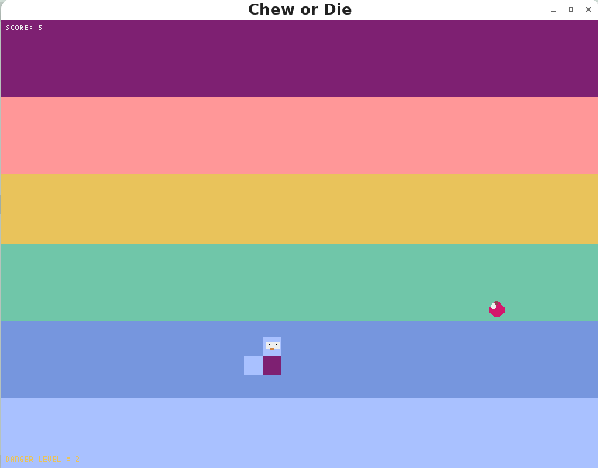
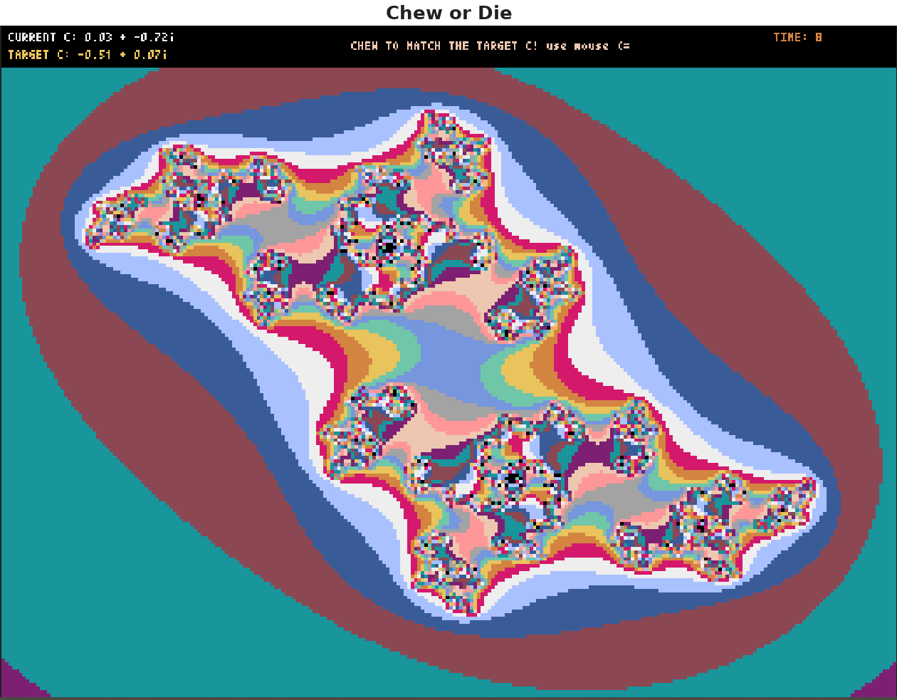

# Chew or Die



**Chew or Die** is a Pyxel-based retro arcade game combining snake game mechanics with a Julia set fractal mini-game where you have to move your mouse to reach a target C value (chewing simulation). 

### Presentation
- [Canva](https://www.canva.com/design/DAG6bXMqrnE/_RlY10UudBhUYTRWOWTY4Q/edit?utm_content=DAG6bXMqrnE&utm_campaign=designshare&utm_medium=link2&utm_source=sharebutton)

### Architecture
The game uses a **state machine pattern** with four distinct modes:
- `MENU_MODE` (0): Main menu with buttons
- `GAME_MODE` (1): Snake gameplay with obstacle dots
- `FRACTAL_MODE` (2): Julia set mini-game (player "chews" by moving mouse/arrows to reach target complex number)
- `LOSE_MODE` (3): Game over screen

### Key Components
1. **`App` class**: Main game controller, manages state transitions and rendering pipeline
2. **`Player` class**: Snake-like entity with direction-based movement, wrapping edges (see `update_movement`)
3. **`DotManager` class**: Spawns and manages falling obstacle dots; difficulty scales with score
4. **`JuliaSet` class**: Renders Julia set fractal and handles fractal mini-game logic
5. **`ui` class**: Renders most illustrations of the game

## Critical Patterns & Conventions

### Game Loop & Rendering
- **Update-Draw Separation**: `update()` handles logic/collisions, `draw()` handles rendering
- **Pyxel Integration**: All drawing uses `pyxel.*` functions; coordinate system is pixel-based (not grid-aligned for fractals)
- **Frame-Based Timing**: Use `pyxel.frame_count` for time-dependent logic (e.g., dot spawning, animation)

### Data Structures
- **Player body**: List of `[x, y]` coordinates; index 0 is head, traversed backwards when moving
- **Dots**: Format `[y, speed, color, sliced, base_x, x]` (sliced=1 when hit)
- **Constants grouped by concern**: Game constants (WIDTH=512, HEIGHT=384), fractal constants (MAX_ITER=40, bounds), mode flags

### Difficulty Progression
Difficulty is driven by **score** and **distance from base Julia constant**

### Collision Detection
- **Dot collision**: AABB check against dot radius (includes margin)
- **Self-collision**: Snake checks if head position is already in body (excluding tail)
- **Fruit collision**: Exact grid alignment check (`hx == self.fruit_x`)
- **Fractal win condition**: Distance-based (`dist < WINNING_TOLERANCE = 0.02`)

### Julia Set & Complex Math
- Target complex number varies per fruit: `c = BASE_C + offset` where offset is ±0.15 in real/imaginary parts
- Iteration function: `z = z*z + c` (standard Mandelbrot-variant formula)
- Color mapping: `color = (iteration_count % 14) + 2`
- **Performance note**: Fractal is rendered at 2x2 pixel step to reduce lag

### Input Handling
- **Game mode**: Arrow keys for movement; direction changes only if not 180° reversal
- **Menu**: Mouse click detection via `_btn_hover()` utility
- **Fractal Manipulation**: Mouse / Touchpad / touchscreen
### Running the Game
1. Download the zip file and extract the game folder from it
2. Go to the folder directory in Terminal and create a virtual environment (venv)
```bash
python3 -m venv .venv
```
3. Activate virtual environment
```bash
source .venv/bin/activate
```
4. Download pyxel into venv
```bash
pip install pyxel
```
5. Run the main.py file
```bash
python3 main.py
```
or if you have only 1 version of python installed:
```bash
python main.py
```

## Common Modification Points

### Adjusting Game Balance
- **Fractal difficulty**: Modify `CHEWING_TIME_SECONDS` (10 seconds default), `WINNING_TOLERANCE` (0.02)
- **Dot spawn**: Edit `DotManager.difficulty_level` formula or base `dot_spawn_interval`
- **Score thresholds**: `score >= 10` gates dot spawning; `score // 30` determines difficulty level

### Adding UI Elements
- Buttons use `draw_button()` pattern: takes position, text, and two colors (base, hover)
- Text positioning is manual (x, y offsets); use `WIDTH // 2` for centering
- Palette: Pyxel colors 0-15; "RAINBOW_COLORS" array defines snake segment progression

## TODOs
- Make Player collision detection better
- Make fractal simulation less laggy
- Insert custom font style to have font size options.
- Manually draw illustrations using Pyxel's built-in drawing program

